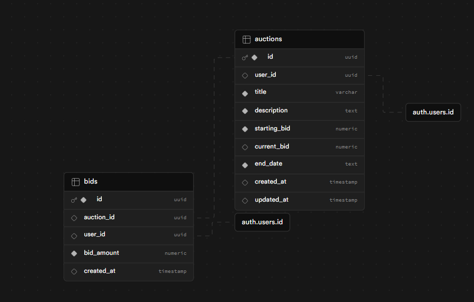

### Features implemented

- [x] User Registration using email, name and password and Authentication using email and password
- [x] Display of all auction items (except the ones user posted themselves)
- [x] Display of users auction items
- [x] List auction item
- [x] Clean code
- [x] Good commit messages following commit conventions
- [x] API endpoint at [/api/products]('/api/products')
- [x] password is hashed

### Deployment

@ [https://abb-project.vercel.app/](https://abb-project.vercel.app/)

### Schema


Supabase creates an automatic users table under auth schema

### Setup on your system

Dependency: pnpm

```sh
npm install -g pnpm
```

```sh
git clone https://github.com/AkshajP/abb-project.git
cd abb-project/
pnpm i
pnpm dev
```
